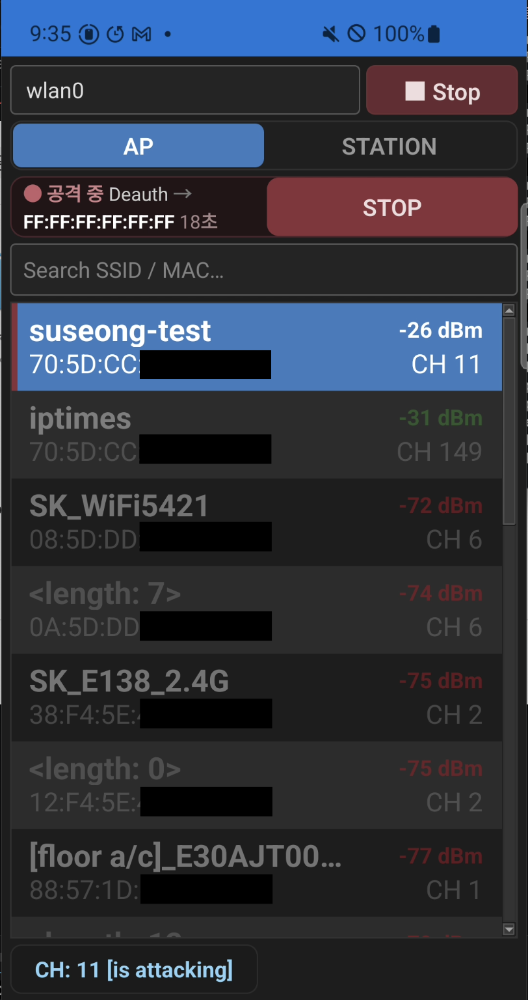

[한국어](README.md) | **English**

# SuNiffing

A Qt app that scans nearby WiFi using nexmon monitor mode on the Galaxy S10,
and performs security testing (deauth, CSA, etc.) in authorized environments.

  

> ⚠️ Use only on networks you **own or have explicit authorization** to test.
> Unauthorized use is illegal, and all responsibility lies with the user.

---

### Requirements

* Galaxy S10 series (S10 Lite excluded)
* Root access
* SELinux permissive

---

### Features

* Scan — real-time discovery of nearby APs / STATIONs
  * 2.4GHz + 5GHz
  * Automatic detection of supported channels
  * ESSID · BSSID · channel · signal strength (dBm)
* Attack (authorized testing only)
  * Deauth — disconnect a target STATION
  * Auth — authentication request flooding
  * CSA — Channel Switch Announcement injection

---

### Usage

1. Prepare an S10 that meets the requirements (root · SELinux permissive)
2. Install and launch the app → select the wireless interface
3. Start → choose the scan band (2.4 / 5 / Dual)
4. Review the discovered APs/STATIONs in the list
5. Long-press a target to open the menu → choose an attack type/parameters → run
6. Stop → end the session (WiFi restored)

---

### Build

* Qt 6.10.2 · Android arm64 (app) + daemon (`android/assets/suseong`)

---

### References

* [S10 ramdisk issue](https://m.blog.naver.com/gorhanhee/224025021274)
* [S10 nexmon issue](https://github.com/seemoo-lab/nexmon/issues/631)
* [Disabling SELinux](https://github.com/evdenis/selinux_permissive)
