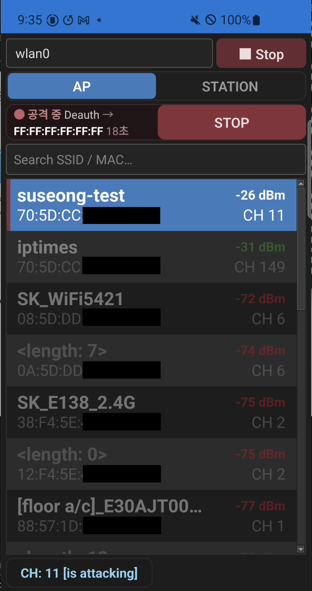

**한국어** | [English](README.en.md)

# SuNiffing

Galaxy S10의 nexmon 모니터 모드로 주변 WiFi를 스캔하고,
인가된 환경에서 보안 점검(deauth·CSA 등)을 수행하는 Qt 앱.

  

  <video src="https://github.com/suseong41/SuNiffing/raw/main/docs/Suniffing_Test.mp4" controls width="600"></video>

> ⚠️ 본인 소유이거나 **명시적으로 허가받은** 네트워크에서만 사용하십시오.
> 무단 사용은 불법이며 그 책임은 전적으로 사용자에게 있습니다.

---

### 준비물

* Galaxy S10 시리즈 (S10 Lite 제외) — BCM4375b1
* root 권한 (Magisk)
* SELinux 비활성화(permissive)
* **nexmon 패치 Wi-Fi 펌웨어** — `/vendor/firmware/bcmdhd_sta.bin_b1`에 패치본이 설치돼 있어야 합니다 (S10용 nexmon Magisk 모듈로 설치). 이 앱의 모니터 모드는 이 펌웨어에 의존합니다.
  * ⚠️ 패치 펌웨어는 특정 베이스 버전(18.41.x)에 묶여 있습니다. **기기의 Wi-Fi 펌웨어 버전과 맞아야** 하며, 맞지 않으면 모니터 모드가 뜨지 않습니다.

> `nexutil`·`libnexmon.so`는 **앱에 번들**되어 실행 시 `/data/local/tmp`로 자동 배포됩니다 — 따로 옮길 필요가 없습니다. 사용자가 별도로 준비할 전제는 위 **패치 펌웨어(Magisk 모듈)** 하나뿐입니다.

---

### 패치 펌웨어 설치

패치 펌웨어는 읽기전용 파티션인 `/vendor`에 들어가야 하므로 **Magisk 모듈**로 올립니다.

1. 패치 펌웨어 Magisk 모듈(`nexmon-s10-fw-*.zip`)을 **Magisk 앱 → 모듈 → 설치**에서 flash
2. 재부팅
3. 확인: `su -c 'grep -ac nexmon /vendor/firmware/bcmdhd_sta.bin_b1'` → `1`이면 정상

> 모듈은 실제 파티션을 건드리지 않고 덮어 마운트하므로, 비활성화하면 원복됩니다.
> dm-verity를 끈 기기라면 `/vendor`에 직접 복사 후 `svc wifi disable; svc wifi enable`로도 적용됩니다.
> ⚠️ 펌웨어는 기기 스톡 **18.41.x 베이스**와 맞아야 합니다(버전 불일치 시 모니터 모드가 뜨지 않음).

---

### 기능

* 스캔 — 주변 AP / STATION 실시간 탐지
  * 2.4GHz + 5GHz
  * 지원 채널 자동 탐색
  * ESSID · BSSID · 채널 · 신호세기(dBm) 표시
* 공격 (인가된 환경에서 점검)
  * Deauth — 대상 STATION 연결 해제
  * Auth — 인증 요청 플러딩
  * CSA — Channel Switch Announcement 주입

---

### 사용 방법

1. 준비물(root · SELinux permissive)을 갖춘 S10 준비
2. 앱 설치 후 실행 → 무선 인터페이스 선택
3. Start → 스캔 대역 선택(2.4 / 5 / Dual)
4. 목록에서 AP/STATION 확인
5. 대상을 길게 눌러 메뉴 → 공격 유형/파라미터 선택 후 실행
6. Stop → 종료 (WiFi 복구)

---

### 빌드

* Qt 6.10.2 · Android arm64(앱) + 데몬(`android/assets/suseong`)

---

### 참고

* [s10 램디스크 문제](https://m.blog.naver.com/gorhanhee/224025021274)
* [s10 nexmon issue](https://github.com/seemoo-lab/nexmon/issues/631)
* [SELinux 비활성화](https://github.com/evdenis/selinux_permissive)
